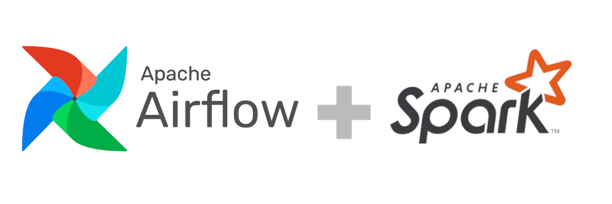

# [Apache Spark+Scala](https://t1.ru/internship/item/otkrytaya-shkola-dlya-inzhenerov-dannykh-data-engineer/). Репозиторий проектов.

## Описание

Открытая школа – это практический курс, рассчитанный на 16 часов вебинаров и 32 часа самостоятельной практики, включая финальный проект.

Проект включает в себя разработку ETL-пайплайнов для обработки и анализа больших данных. Используя инструменты Scala и Apache Spark, реализованы решения для обработки данных в рамках Hadoop экосистемы. AirFlow используется для организации и автоматизации рабочих процессов.

## Технологии
- Apache Spark (Python API)
- Hadoop
- Apache AirFlow
- Python
- SQL

## Структура

| Номер проекта                | Название проекта                          | Краткое описание                                                                                                     |
|------------------------------|-------------------------------------------|----------------------------------------------------------------------------------------------------------------------|
| [Проект 7](project6)       | Автоматизированный Data Pipeline          | Создание DAG в Airflow, который будет считать с помощью spark считать агрегаты по регионам и загружать в postgre через jdbc. Даг должен быть идемпотентным |
| [Проект 6](project6)       | Автоматизированный Data Pipeline          | Создание DAG в Airflow для автоматизации процесса подсчета аггрегатов и сохранения результатов в БД postgres |
| [Проект 5](project5)       | Автоматизированный Data Pipeline          | Создание DAG в Airflow для автоматизации процесса создания папки на дневной основе и дальнейшее сохранение отфильтрованных данных в эти папки на          |
| [Проект 4](project4)       | Анализ данных популярных песен и артистов | Анализ данных о популярных песнях и артистах с использованием Spark, включая оптимизацию запросов.                   |
| [Проект 3](project3)       | Задания по Scala и Apache Spark           | Решение задач на Scala с использованием Spark, включая работу с датасетами, DataFrame, агрегирование и ранжирование данных. |
| [Проект 2](project2)       | Задание по Apache Spark (PySpark)         | Использование PySpark для обработки и агрегации больших данных, включая создание RDD и DataFrame.                    |
| [Проект 1](project1)       | Задание на MapReduce                      | Решение задачи поиска числа в массиве с использованием MapReduce в HDFS.                                             |
| [Проект 0](project0)       | Задание на проверку соединения и доступа  | Вводное задание (проверка соединения и доступа) на проверку доступа к Spark кластеру.                                |
